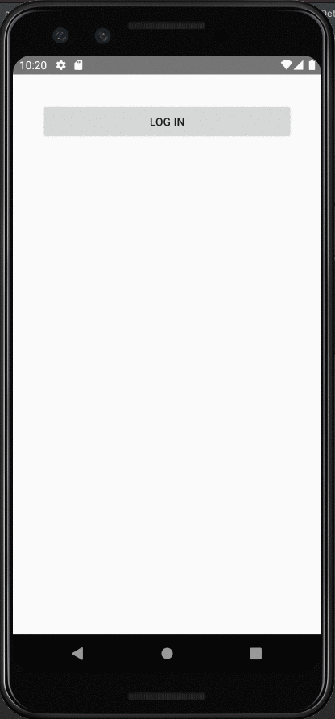

# Project 3 - Lizzy's Twitter 

Twitter is an android app that allows a user to view their Twitter timeline and post a new tweet. The app utilizes [Twitter REST API](https://dev.twitter.com/rest/public).

Time spent: 18 hours spent in total

## User Stories

The following **required** functionality is completed:

* [X]	User can **sign in to Twitter** using OAuth login
* [X]	User can **view tweets from their home timeline**
  * [X] User is displayed the username, name, and body for each tweet
  * [X] User is displayed the [relative timestamp](https://gist.github.com/nesquena/f786232f5ef72f6e10a7) for each tweet "8m", "7h"
* [X] User can **compose and post a new tweet**
  * [X] User can click a “Compose” icon in the Action Bar on the top right
  * [X] User can then enter a new tweet and post this to Twitter
  * [X] User is taken back to home timeline with **new tweet visible** in timeline
  * [X] Newly created tweet should be manually inserted into the timeline and not rely on a full refresh
* [X] User can **see a counter with total number of characters left for tweet** on compose tweet page
* [X] User can **pull down to refresh tweets timeline**
* [X] User can **see embedded image media within a tweet** on list or detail view.

The following **optional** features are implemented:

* [X] User is using **"Twitter branded" colors and styles**
* [ ] User sees an **indeterminate progress indicator** when any background or network task is happening
* [X] User can **select "reply" from home timeline to respond to a tweet**
  * [X] User that wrote the original tweet is **automatically "@" replied in compose**
* [X] User can tap a tweet to **open a detailed tweet view**
  * [ ] User can **take favorite (and unfavorite) or retweet** actions on a tweet
* [ ] User can view more tweets as they scroll with infinite pagination
* [ ] Compose tweet functionality is built using modal overlay
* [ ] User can **click a link within a tweet body** on tweet details view. The click will launch the web browser with relevant page opened.
* [ ] Replace all icon drawables and other static image assets with [vector drawables](http://guides.codepath.org/android/Drawables#vector-drawables) where appropriate.
* [ ] User can view following / followers list through any profile they view.
* [ ] Use the View Binding library to reduce view boilerplate.
* [ ] On the Twitter timeline, apply scrolling effects such as [hiding/showing the toolbar](http://guides.codepath.org/android/Using-the-App-ToolBar#reacting-to-scroll) by implementing [CoordinatorLayout](http://guides.codepath.org/android/Handling-Scrolls-with-CoordinatorLayout#responding-to-scroll-events).
* [ ] User can **open the twitter app offline and see last loaded tweets**. Persisted in SQLite tweets are refreshed on every application launch. While "live data" is displayed when app can get it from Twitter API, it is also saved for use in offline mode.

The following **additional** features are implemented:

* [X] Logout button is displayed on the Toolbar

## Video Walkthrough

Here's a walkthrough of implemented user stories:

## Notes on Challenges

1. Since the reply button was a stretch story, it took a couple tries to find the best way to display it. I tried an ImageButton and XML selector before finding the drawableLeft parameter for a button. Once the button was in place, the existing ComposeActivity made it easy to compose a tweet with the original user's handle.
2. While trying to show embedded images, I found that some tweets which didn't have images were showing other tweets' sporadically, and the behavior was inconsistent and could sometimes be fixed a refresh. By logging the attributes associated with various tweets, like tweet body and media link, I realized that the bug was because dirty views within the RecyclerView with images previously populated were being recycled without reversing the imageView visibility. This was a fun bug to solve because it directly illustrated concepts about how RecyclerViews work. 
3. Also with the embedded images, I had issues getting the view to show up where I wanted it- it would wither be center aligned when I had clearly set the dimensions wider in the layout file, or the corners wouldn't round. Eventually, I realized that there are special functions (ie. transforms) for applying multiple transformations with the Glide library. 

## Open-source libraries used

- [Android Async HTTP](https://github.com/loopj/android-async-http) - Simple asynchronous HTTP requests with JSON parsing
- [Glide](https://github.com/bumptech/glide) - Image loading and caching library for Android
